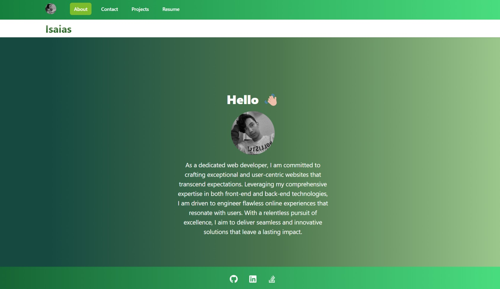

# React Portfolio
  ## Licence:
  

  ## Description
  The task is to create a portfolio using my React skills, which will help my portfolio to set apart from other portfolios that don’t use the latest technologies.
  Being a web developer means being part of a community. This portfolio will help me share my projects while i'm applying for jobs or working as a freelancer and also to share my work with other developers and collaborate on projects.
 

  ## Table of Contents
  - [Installation](#installation)
  - [Usage](#usage)
  - [Credits](#credits)

  ## Installation
  This is a screenshot of the application:

  - This is the link to the deployed app: https://fascinating-snickerdoodle-880928.netlify.app
  
  

  ## Usage
  - You can run it locally by cloning the repo and opening the index.html file in your browser.
  - You can just go to the the deployed app and start using it there.

  ## Credits
  N/A
